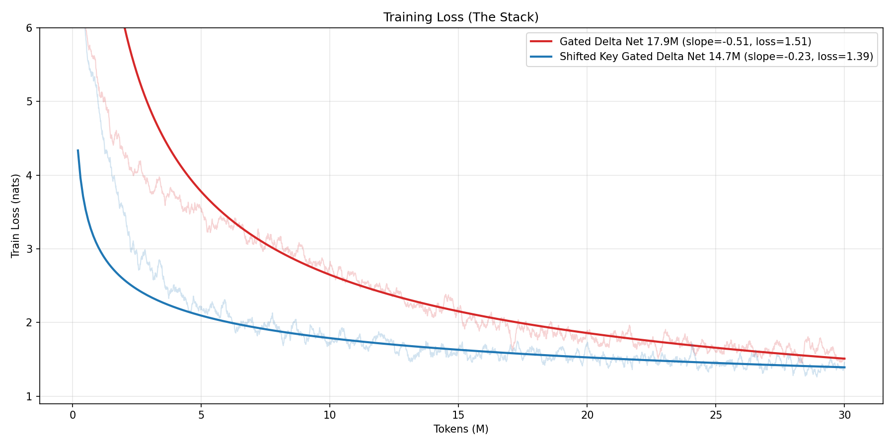
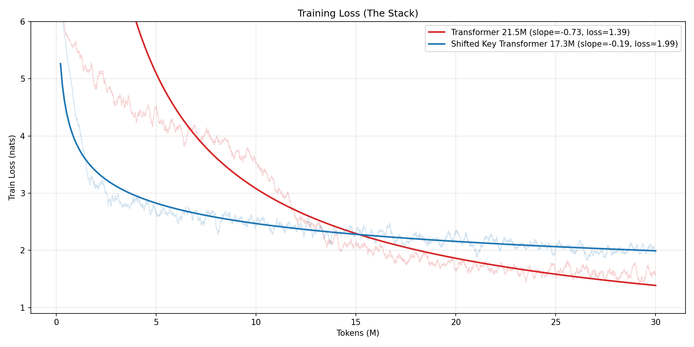
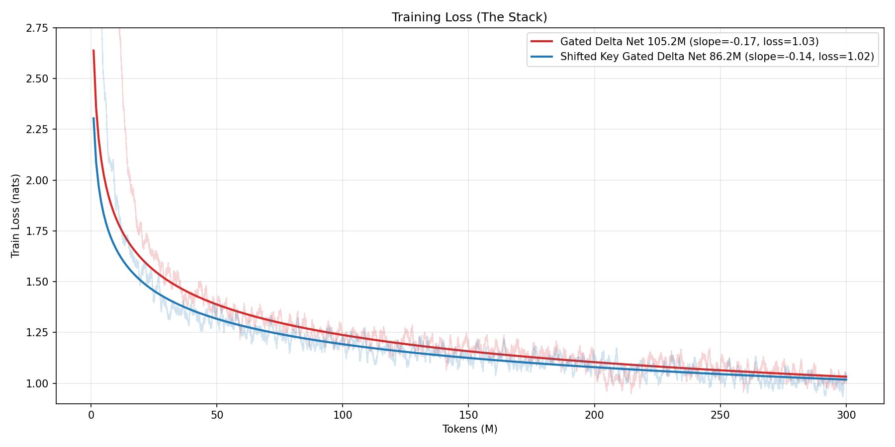
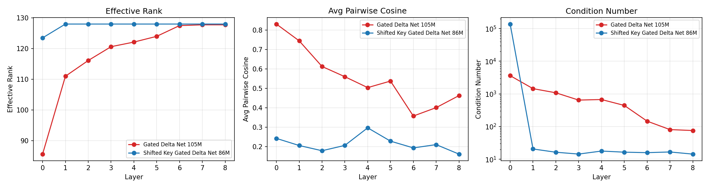

# Removing Q/K Projections for Gated Delta Net Slightly Improves Performance at ~15% Fewer Parameters
Surprisingly, we can remove the query and key projections in Gated Delta Net by directly using:
1. Current hidden state as the query vector
2. Previous hidden state as the key vector

Results:
**Faster convergence, marginally better performance despite strictly fewer parameters, and saves ~12.5% to ~25% of a layer's parameters.**

For a ~100M parameter model trained for 300M tokens on coding samples(The Stack), a Shifted Key Gated Delta Net has a fitted training loss of 1.02 compared to 1.03 of a normal Gated Delta Net model.

We also show the same concept does not apply to softmax attention. Concept was discovered by Opus 4.6.
The shift is similar to RWKV token lerp, but removes Q/K projections completely.

## Attention Quick Review
Attention uses x_t (hidden state at position t) to generate the key k_t and value v_t vectors, one per previous token, as well as the current query vector q_t.

In a simplified example with word tokens, we need to predict the blank:

| | 0 | 1 | 2 | 3 | 4 | 5 | 6 | 7 | |
|---|---|---|---|---|---|---|---|---|---|
| **state** | x_0 | x_1 | x_2 | x_3 | x_4 | x_5 | x_6 | x_7 | |
| **token** | The | dog | barked. | The | man | saw | the | dog | ____? |
| **query** | q_0 | q_1 | q_2 | q_3 | q_4 | q_5 | q_6 | q_7 | |
| **key** | k_0 | k_1 | k_2 | k_3 | k_4 | k_5 | k_6 | k_7 | |
| **value** | v_0 | v_1 | v_2 | v_3 | v_4 | v_5 | v_6 | v_7 | |

Key vectors encode for a token "what am I", value vectors encode for a token "what I mean in context", and the query vector encodes for the current prediction, "what other tokens are relevant?"

In our example, using query vector q_7, q_7 · k_t tells us the relevance of any previous token t. For example, `dog` and `barked` are more relevant than `The`.
After calculating relevance scores, normalized by softmax, we get a weighted average of all the previous value vectors that inform our final prediction.

## Linear Attention Quick Review
Because attention requires keeping all previous k, v vectors, cost grows with sequence length. Linear attention circumvents this with a fixed-size state instead.

pros
* no growing memory/compute costs.
cons
* no free lunch. Compression is inherently lossy and recall is worse.

Mechanism explanation:
With two k, v vectors, first take the outer product v⊗k, written also as (v · k^T).
Afterwards, multiplying v⊗k by k again, we get v · (k^T @ k) = v · ‖k‖².
Note, v⊗k is a matrix. Multiplying the matrix k returns v (scaled to k).

We store each token's k,v in a fixed-size matrix M by doing M += v⊗k, continually ading new k, v pairs to memory.
However, because M is fixed size, eventually all the keys start to overlap, so if two keys were similar, querying will return a combination of the two corresponding values. We can think of M is a lossy fixed-size KV cache.

In practice various gating and decay mechanisms mitigate the key collision/capacity issues.

## Shifted Key Trick
Normally, the q, k vectors are generated from learned q, k projections, but the shifted key trick skips the learned projections entirely. Instead we directly use:
(x_t is the hidden state at position t):
1. x_{t-1} as the key vector k_t, for v_t. This binds the previous state to the current value.
2. x_t as the query vector. Due to the key shift, querying the memory matrix with x_t returns "for positions similar to x_t, what came after?"

Going back to our example:

| | 0 | 1 | 2 | 3 | 4 | 5 | 6 | 7 | |
|---|---|---|---|---|---|---|---|---|---|
| **state** | x_0 | x_1 | x_2 | x_3 | x_4 | x_5 | x_6 | x_7 | |
| **token** | The | dog | barked. | The | man | saw | the | dog | ____? |
| **key** | 0 | x_0 | x_1 | x_2 | x_3 | x_4 | x_5 | x_6 | |
| **value** | v_0 | v_1 | v_2 | v_3 | v_4 | v_5 | v_6 | v_7 | |

The assocations become:
1. The -> dog
2. dog -> barked
3. barked. -> The
4. The -> man
5. man -> saw
...

To predict the blank, our hidden state x_7 is "dog", similar to x_1, which strengthens the v_2 representation for "barked".

The shifted key hard prior fixes the symmetric memory matrix issue of linear attention normally solved by learned Q/K projections. Because the hidden state x_t is input to both the k_t, v_t vectors, the symmetric key-value pairs don't encode what comes next: e.g. the key might represent "I am the dog token" and value might represent "meaning of dog". Without the shifted key, our current hidden state is "dog", so when we query the matrix, we get "meaning of dog" back, when we actually wanted "meaning of bark".

This symmetry issue doesn't apply to softmax attention, which retains all previous keys to query against.

We can also think of the shifted key as copy/paste - after I see x, think of y - which does seem extremely limiting since associations are restricted to neighboring tokens.
However, empirically at 100M parameter sizes it still seems to work, perhaps suggesting that for linear attention models, the q, k projections are mostly about:
1. Learning to break the symmetry in the memory matrix
2. Forming good orthogonal keys to fully utilize the key space
3. Associating abstract concepts rather than raw words

It seems that the raw hidden states serve these responsibilities well enough or better.

## Experiments
Disclaimer - all models are decently undertrained. Curves are fit on the last 80% of training to avoid too much early training influence. Sequence length is 2048, vocab of 1024.

### 18M Scale Testing
We train a baseline 17.9M parameter Gated Delta Net and 14.7M Shifted Key Gated Delta Net models for 30M tokens, batch size 4 on coding examples (The Stack). Layers and model dimensions are the same besides removing QK.

For the training losses with smoothed data points, we see the token shift performs better despite having fewer parameters and less expressiveness.

However for transformers, the shifted key transformer performs worse. This suggests while softmax attention and linear attention derive from similar concepts, they do behave differently. While both are doing pattern matching, perhaps softmax attention does it through querying/recalling exact past keys, while linear attention does a fuzzier general pattern matching.

### 100M Scale Testing
We scale up to 105M for Gated Delta Net and 86.2M Shifted Key Gated Delta Net, trained for 300M tokens, batch size 1.

The shifted key model maintains a small lead despite ~15% fewer parameters, as well as faster convergence due to not needing to learn QK projections.

Lastly, the shifted key model seems to utilize its keys "better" for storing information across its layers with three metrics:
1. Effective rank - how many different keys are being stored.
2. Avg pairwise cosine - how close and "jumbled" keys are for clean retrieval.
3. Condition number - how well the keys as a whole use the dimensional "storage" space.

The shifted key model performs better on all metrics except condition number at layer 0, which is an artifact of adding a padding key since at position 0 there's no previous hidden state to use as the key.

## Conclusions
I'm not exactly sure why this works. While it seems to make intuitive sense that associations can be chained together to form memory, it is confusing that restriction of only associating directly neighboring tokens doesn't impact performance more. Perhaps this is too restrictive at scale, although it does seem to demonstrate linear attention related models are genuinely different in some way.
